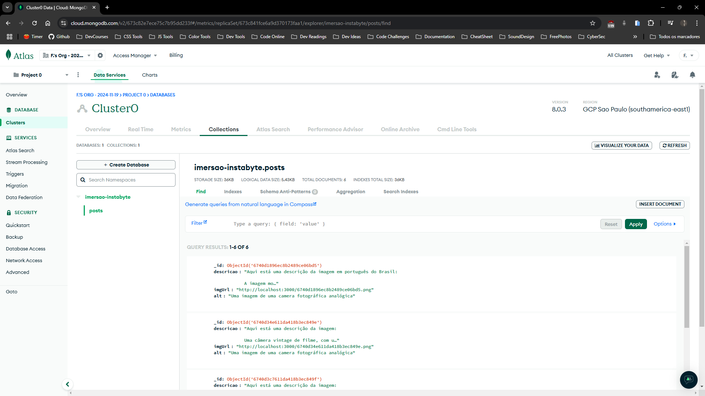
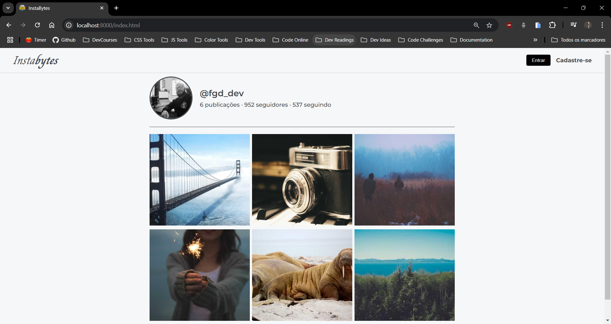
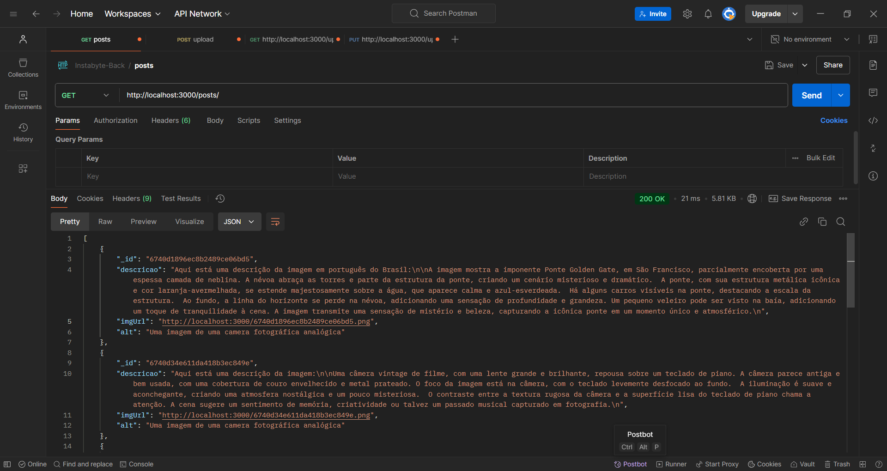
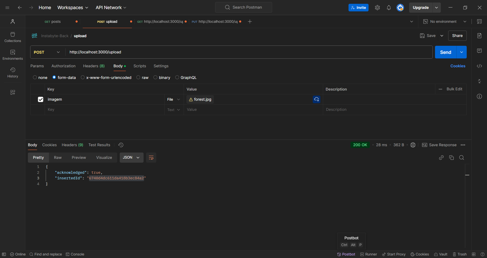
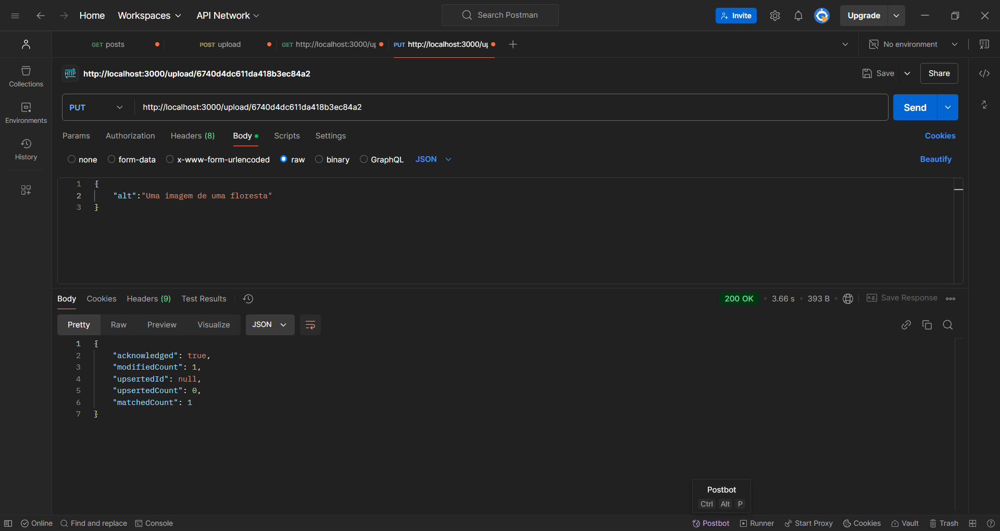
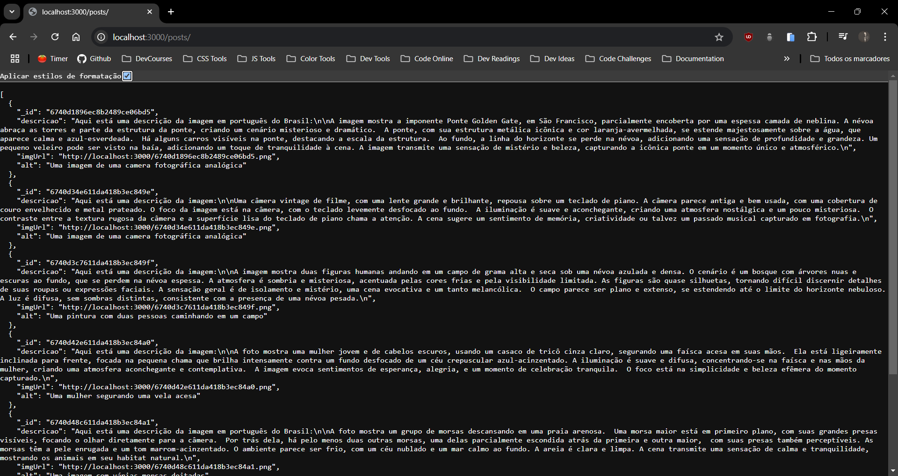
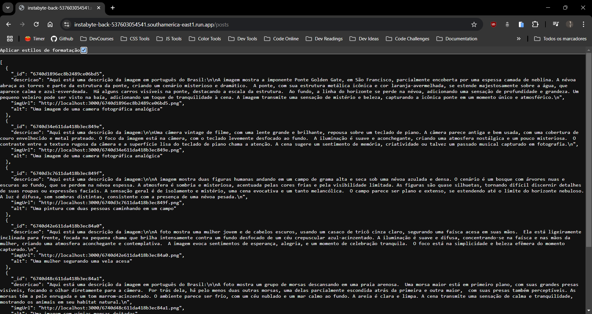

# Imersão Dev Back-End Alura com Google Gemini

### Ferramentas utilizadas

---

## Aula 1

- Apresentação do projeto blog de fotos;
- Intalação do Node.js;
- O que é um servidor;
- Criando e subindo um servidor Node.js;
- Criação de uma API Key do Gemini

---

## Aula 2

- Criação de uma base de dados;
- Criação de um 'mock' com ajuda do Gemini;
- Armazenamento dos dados;
- Adição de rotas;
- Utilização de bancos de dados MongoDB;
- Preparação do MongoDB para subir os recursos na Nuvem

---

## Aula 3

- Configuração do primeiro Cluster, Database e coleção no MongoDB;
- Criação de variáveis de ambiente;
- Conecção entre API e Banco de Dados via String de conexão;
- Criação de código de configuração do banco na API;
- Refatoração do primeiro get

---

## Aula 4

- Envio de informações para a base de dados;
- Verbos HTTP;
- Criação das rotas post/ e /upload com verbo HTTP POST;
- Implementação de upload de imagens;
- Teste de API com o 'Thunder Client' e 'Postman'

---

## Aula 5

- Lógica de armazenamento de imagens no servidor;
- Criação de rota PUT para atualização de post;
- Integração com a API do Gemini;
- Integração do back-end com o front-end;
- Deploy do back-end na Google Cloud

---

### Imagens

- MongoDB Cluster0

- Front-end

- Postman (GET, POST, PUT)

- API Instabyte

- API Google Cloud

